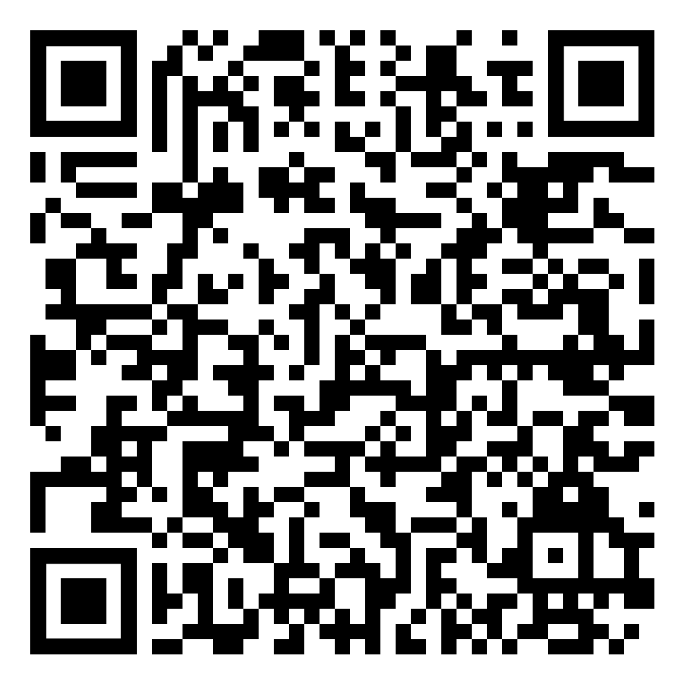

Repository for Exercise 1.5 of Embedded Cryptography Book Section 9

In this exercise, you can play with a MO-TRNG again
By scanning or clicking on the QR-code you can launch the application and observe how the number of oscillators,the jitter variance and the accumulation time affect the results of 5 black boxes tests that are proposed in the AIS31 and in the FIPS 140-1 suites.

Your goal is to find the the smallest D, for which the generated data would pass all five black box tests.

You should repeat the procedure for all possible &#x3C3tot &#8260 T1 and 	N values.

